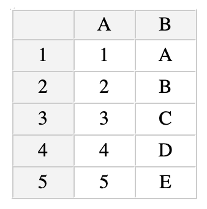
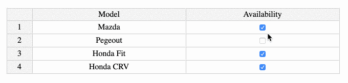
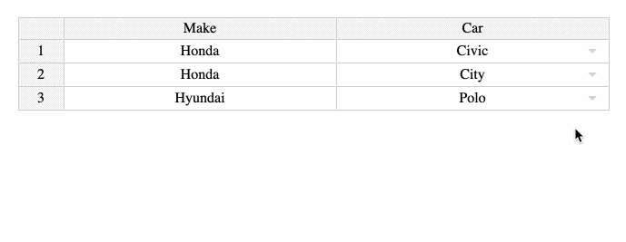
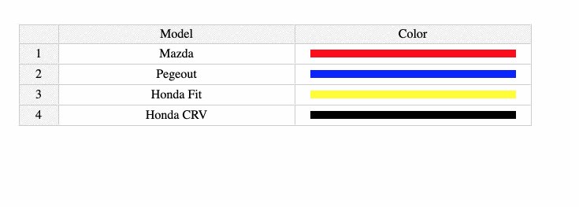
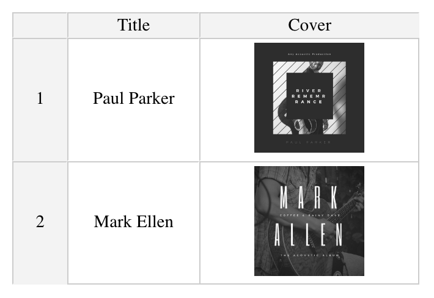
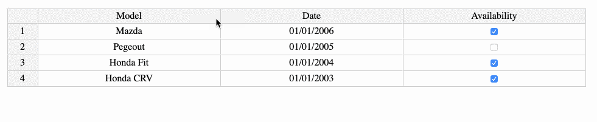
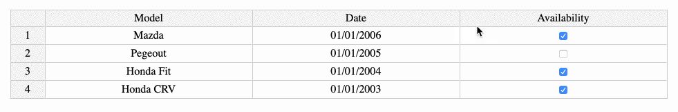
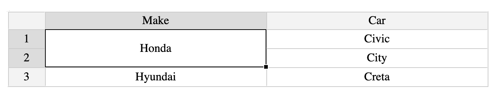
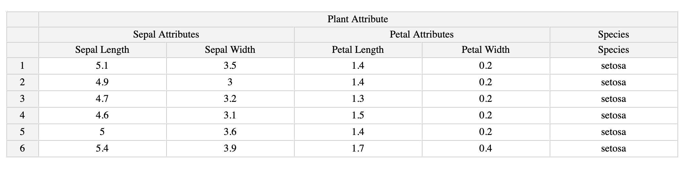

```{r setup, include=FALSE}
knitr::opts_chunk$set(echo = TRUE)
```
[](https://CRAN.R-project.org/package=excelR)
[](http://cran.r-project.org/package=excelR)
[](https://travis-ci.org/Swechhya/excelR)
[](https://ci.appveyor.com/project/Swechhya/excelR)
[](https://codecov.io/gh/Swechhya/excelR)

# excelR
An R interface to [jExcel](https://bossanova.uk/jexcel/v3/) library to create web-based interactive tables and spreadsheets compatible with Excel or any other spreadsheet software.


To install the stable CRAN version: 
```r
install.packages('excelR')
```
To install the latest development version from GitHub:
```r
library(devtools)
install_github('Swechhya/excelR')
```

## Usage

#### Getting Started {#getting-started}

Excel tables can be created using `excelTable` function as shown below:

```r 
library(excelR)

data = data.frame(A =c (1:5), B = c(LETTERS[1:5]))

excelTable(data=data)
```


#### Basic Usage {#basic-usage}
```r
library(excelR)

 data = data.frame(Model = c('Mazda', 'Pegeout', 'Honda Fit', 'Honda CRV'),
                   Date=c('2006-01-01', '2005-01-01','2004-01-01', '2003-01-01' ),
                   Availability = c(TRUE, FALSE, TRUE, TRUE))

 columns = data.frame(title=c('Model', 'Date', 'Availability'),
                      width= c(300, 300, 300),
                      type=c('text', 'calendar', 'checkbox')) 
 excelTable(data=data, columns = columns)
```


## Features
This documentation gives example for following features:

1. [Different types of columns](#different-types-of-columns)
2. [Row and column resizing](#resizing)
3. [Drag and drop rows and columns](#drag-drop)
4. [Merge rows and columns](#merge)
5. [Nested headers](#nested-headers)
6. [Pagination](#pagination)
7. [Search](#search)
8. [Excel formulas](#excel-formulas)
9. [Style](#style)
10. [Automated Column Types](#auto-col-types)
11. [Toolbar](#toolbar)
12. [Shiny Integration](#shiny-integration)

#### Different types of columns{#different-types-of-columns}
 - Calendar
 ```r
 library(excelR)

 data = data.frame(Model = c('Mazda', 'Pegeout', 'Honda Fit', 'Honda CRV'),
                   Date=c('2006-01-01', '2005-01-01','2004-01-01', '2003-01-01' ))

 columns = data.frame(title=c('Model', 'Date' ),
                      width= c(300, 300),
                      type=c('text', 'calendar')) 
 excelTable(data=data, columns = columns)
 ```


- Checkbox
```r
library(excelR)

 data = data.frame(Model = c('Mazda', 'Pegeout', 'Honda Fit', 'Honda CRV'),
                   Availability = c(TRUE, FALSE, TRUE, TRUE))

 columns = data.frame(title=c('Model', 'Availability'),
                      width= c(300, 300),
                      type=c('text', 'checkbox')) 
 excelTable(data=data, columns = columns)
```


- Dropdown
```r
library(excelR)

 data = data.frame( Make = c('Honda', 'Honda', 'Hyundai'), 
          Car = c('Civic', 'City', 'Polo'))

 columns = data.frame(title=c('Make', 'Car'),
                      width= c(300, 300),
                      type=c('text', 'dropdown'),
                      source=I(list(0,c('Civic', 'City',  'Polo', 'Creta', 'Santro'))))
 excelTable(data=data, columns = columns)
```


- Radio
```r
library(excelR)

 data = data.frame(Model = c('Mazda', 'Pegeout', 'Honda Fit', 'Honda CRV'),
                   Choice = c(FALSE, FALSE, FALSE, TRUE))

 columns = data.frame(title=c('Model', 'Choice'),
                      width= c(300, 300),
                      type=c('text', 'radio')) 
 excelTable(data=data, columns = columns)
```


- Color
```r
library(excelR)

 data = data.frame(Model = c('Mazda', 'Pegeout', 'Honda Fit', 'Honda CRV'),
                   Color= c('red', 'blue', 'yellow', 'black'))

 columns = data.frame(title=c('Model', 'Color'),
                      width= c(300, 300),
                      type=c('text', 'color'),
                      render=c(0, 'square')) 
 excelTable(data=data, columns = columns)
```


- Image
```r
library(excelR)

data <- data.frame(Title = c("Paul Parker", "Mark Ellen"),
                   Cover =  c("https://marketplace.canva.com/MACcZp2p4po/2/0/thumbnail_large/canva-black-white-acoustic-album-cover-MACcZp2p4po.jpg",                          "https://marketplace.canva.com/MACcY55adP4/1/0/thumbnail_large/canva-black-and-white-masculine-acoustic-modern-album-cover-MACcY55adP4.jpg"))

columns <- data.frame(title = colnames(data),
                      type = c("text", "image"),
                      width = c(120, 200))

excelTable(data = data, columns = columns)

```


#### Row and Column Resizing{#resizing}
```r
library(excelR)

 data = data.frame(Model = c('Mazda', 'Pegeout', 'Honda Fit', 'Honda CRV'),
                   Date=c('2006-01-01', '2005-01-01','2004-01-01', '2003-01-01' ),
                   Availability = c(TRUE, FALSE, TRUE, TRUE))

 columns = data.frame(title=c('Model', 'Date', 'Availability' ),
                      width= c(300, 300, 300),
                      type=c('text', 'calendar', 'checkbox')) 
 excelTable(data=data, columns = columns, rowResize = TRUE)
```


#### Drag and Drop Rows and Columns {#drag-drop}
```r
library(excelR)

 data = data.frame(Model = c('Mazda', 'Pegeout', 'Honda Fit', 'Honda CRV'),
                   Date=c('2006-01-01', '2005-01-01','2004-01-01', '2003-01-01' ),
                   Availability = c(TRUE, FALSE, TRUE, TRUE))

 columns = data.frame(title=c('Model', 'Date', 'Availability' ),
                      width= c(300, 300, 300),
                      type=c('text', 'calendar', 'checkbox')) 
 excelTable(data=data, columns = columns, rowDrag = TRUE, columnDrag = TRUE)
```


#### Merge Rows and Columns {#merge}
```r
library(excelR)

data = data.frame( Make = c('Honda', 'Honda', 'Hyundai'),
                   Car = c('Civic', 'City', 'Creta'))

 columns = data.frame(title=c('Make', 'Car'), width= c(300, 300))
                      
excelTable(data=data, columns = columns,  mergeCells = list(A1=c(1,2)))
```


#### Nested Headers {#nested-headers}
```r
library(excelR)

 columns = data.frame(title=c('Sepal Length', 'Sepal Width', 'Petal Length','Petal Width', 'Species'),
                      width= c(200, 200, 200, 200, 200))
                      
 nestedHeaders = list( data.frame(title=c("Plant Attribute"), colspan=c(5)), 
                       data.frame(title=c("Sepal Attributes", "Petal Attributes", "Species"), 
                                  colspan=c(2, 2, 1)))
 excelTable(data=head(iris), columns = columns, nestedHeaders = nestedHeaders)
```


#### Pagination {#pagination}

```r
library(excelR)

 columns = data.frame(title=c('Sepal Length', 'Sepal Width', 'Petal Length','Petal Width', 'Species'),
                      width= c(200, 200, 200, 200, 200))
                      
 excelTable(data = iris, columns = columns, pagination=10)
```


#### Search {#search}
```r
library(excelR)

 columns = data.frame(title=c('Sepal Length', 'Sepal Width', 'Petal Length','Petal Width', 'Species'),
                      width= c(200, 200, 200, 200, 200))
                      
 excelTable(data = iris, columns = columns, search=TRUE)
```


#### Excel formulas {#excel-formulas}
```r
library(excelR)

 columns = data.frame(title=c('Sepal Length', 'Sepal Width', 'Petal Length','Petal Width', 'Species'),
                      width= c(200, 200, 200, 200, 200))
                      
 excelTable(data=head(iris), columns = columns, minDimension = c(5, 7))
```


#### Style {#style}

Styling in version `0.1.0`:
```r
 library(excelR)

 data = data.frame( Make = c('Honda', 'Honda', 'Hyundai'),
                   Car = c('Civic', 'City', 'Creta'))

 columns = data.frame(title=c('Make', 'Car'), width= c(300, 300))
  
 style = list(A1=c('background-color:orange', 'color:green'), 
              B1=c('background-color:orange', 'color:green'))
                      
 excelTable(data=data, columns = columns, style = style)
```

Styling from version `0.2.0` onwards:
```r
 library(excelR)

 data = data.frame( Make = c('Honda', 'Honda', 'Hyundai'),
                   Car = c('Civic', 'City', 'Creta'))

 columns = data.frame(title=c('Make', 'Car'), width= c(300, 300))
  
 style = list(A1='background-color:orange; color:green;', 
              B1='background-color:orange; color:green;')
                      
 excelTable(data=data, columns = columns, style = style)
```


#### Automated Column Types {#auto-col-types}
```r
library(excelR)

 data = data.frame(Model = c('Mazda', 'Pegeout', 'Honda Fit', 'Honda CRV'),
                   Date=c(as.Date('2006-01-01'), as.Date('2005-01-01'), as.Date('2004-01-01'), as.Date('2003-01-01') ),
                   Availability = c(TRUE, FALSE, TRUE, TRUE), stringsAsFactors = FALSE)

 columns = data.frame(title=c('Model', 'Date', 'Availability' ),
                      width= c(300, 300, 300)) 
 excelTable(data=data, columns = columns)
```


#### Toolbar {#toolbar}
```r
library(excelR)

 data = data.frame(Model = c('Mazda', 'Pegeout', 'Honda Fit', 'Honda CRV'),
                   Date=c('2006-01-01', '2005-01-01','2004-01-01', '2003-01-01' ))

 columns = data.frame(title=c('Model', 'Date'),
                      width= c(200, 200),
                      type=c('text', 'calendar')) 
 excelTable(data=data, columns = columns, showToolbar=TRUE)
```


### Shiny Integration {#shiny-integration}

#### Creating excel table in Shiny
```r
  library(shiny)
  library(excelR)

   shinyApp(
     ui = fluidPage(excelOutput("table")),
     server = function(input, output, session) {
       output$table <-
      renderExcel(excelTable(data = head(iris)))
      }
    )

```
#### Reading changed data from excel table in Shiny
```r
  library(shiny)
  library(excelR)

   shinyApp(
     ui = fluidPage(excelOutput("table")),
     server = function(input, output, session) {
       output$table <-
      renderExcel(excelTable(data = head(iris)))
      observeEvent(input$table,{
        table_data <- excel_to_R(input$table)
        if(!is.null(table_data)){
        print(table_data)
        }
        
      })
      }
    )

```
#### Getting/Setting comment in Shiny
```r
library(excelR)
library(shiny)

shinyApp(
  
  ui = fluidPage(actionButton('set', 'Set Comments to cell A1'),
                 actionButton('get', 'Get Comments from cell A1'),
                 textAreaInput("fetchedComment", "Comments from A1:"),
                 excelOutput("table", height = 175)),
                 
  server = function(input, output, session) {
  
      output$table <- renderExcel(excelTable(data = head(iris), allowComments = TRUE))
      
      # Set the comment
      observeEvent(input$set,{
        setComments("table", "A1", "This is a comment")
      })
      
      # Get the comment
      observeEvent(input$get,{
          getComments("table", "A1")
      })
      
      # Print the comment to the text area
      observeEvent(input$table,{
        updateTextAreaInput(session, 'fetchedComment', value = input$table$comment )
      })
    }
  )

```


#### Getting selected data in Shiny

```r
library(excelR)
library(shiny)

shinyApp(
  
  ui = fluidPage( tags$h6("Selected Data:"),
                  tableOutput("selectedData"),
                  tags$h6("Excel Table:"),
                 excelOutput("table", height = 175)),
  
  server = function(input, output, session) {
    
    output$table <- renderExcel(excelTable(data = head(iris), getSelectedData = TRUE))
    
    # Print the selected data in table
    observeEvent(input$table,{
      output$selectedData <- renderTable(get_selected_data(input$table))
    })
  }
)

```

